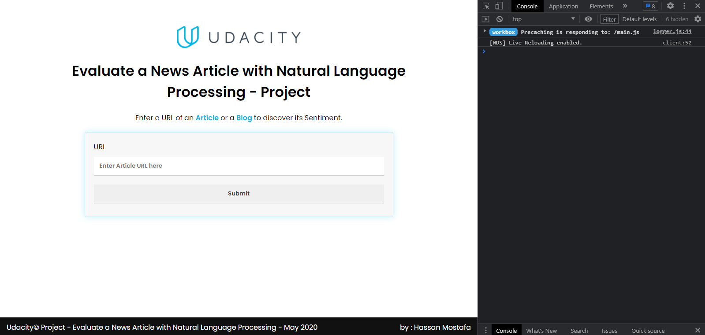

# Udacity Project

## Evaluate a news article with Natural Language Processing (NLP) 

**Right after downloading and before anything you must run in the project directory's cmd the command line `npm install` to install the dependencies and devDependencies**

1 - `npm start` Is the command to start the server. Please make sure to run it before running the app
> It will be running on PORT 8000 **The Server Must Be Running during any testing**

2 - `npm run build-dev` Is the command line to start the development mode for the app  
> It will be running on PORT 8001

3 - `npm run build-prod` Is the command line to run webpack production mode and will create a `dist` folder with the HTML, CSS and JS files minified
> 3 JS files, 1 CSS and 1 HTML
> This will be the deployed version I'm hosting it via Netlify through a different repository 

4 - `npm test` Is the command line to run a jest's test on the app 
> Test Suites: 3 total 
> Tests: 6 total

---

About the API's key It must be in an .env file with a var name `API_KEY` beucase of the way it's been passed to the server `process.env.API_KEY`

---

## Deployment
I used a different repository to deploy the app because it was required to add dist folder in the .gitignore so I couldn't use the production folder in this repo 
> Link to the hosted repository https://github.com/HassanMostafaa/Udacity-Project-1-deploy

> Demo via **Netlify** : https://articles-evaluation.netlify.app/ 

---

